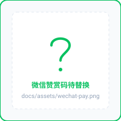

# 千川工作台

这是给客户 Agent 使用的本地、私有、只读优先工作台。不同模型品牌不代表相同的本地能力：能执行命令和连接 MCP 的 Agent 按启动手册走；纯聊天客户端由用户双击启动入口并按界面操作。用户本人必须完成千川登录、Cookie Editor 文件导入，并确认账户和主计划。

从 [AGENT_START.md](AGENT_START.md) 开始。缺少 Node.js/npm 时，Agent 先按 [依赖安装](docs/依赖安装.md) 自行安装并验证。随后执行：

```powershell
node tools/setup.cjs --check --json
node tools/setup.cjs --json
```

第一条只检查；第二条按需安装依赖、生成本机 MCP 环境并启动。以 JSON 返回的 `url`、`mcp`、`skill_entry`（兼容 `skill.entry`）和 `next_step`（兼容 `next`）为准，下一步不由模型自拟，不让用户手填路径、端口或环境变量。外部 MCP 客户端必须按自身支持的格式连接返回入口，`.mcp` 不保证对所有客户端自动生效。

接入时先调用 `setup_account` 的 `status`。已有账户续接，不重复登录；无账户时引导用户打开本机 `/v4#/onboarding`。固定说：“现在请你本人登录千川，并用 Cookie Editor 导出 JSON 文件后在本机选择；这一步需要你自己完成，不是一键登录。”Cookie 不粘贴到聊天，也不交给 Agent。

Agent 按 `next_questions` 一次只问一个问题，用返回 `revision` 和真实 schema 字段保存草稿；不确定数值留空或传 `null`，不能把未知写成 0。主计划由用户核对选择。先 `rehearse`，展示身份、模式、来源时间和缺口，用户明确确认后才 `save(confirm=true)`。每一步只读取当前所需资料，默认只读取随包 `skills/qianchuan-ops/SKILL.md`。

本包默认 `recommendation_only`，不自动投放。保存后用 `status`、`load_account_profile` 和 `get_live_view` 只读回读。随包 `skills/qianchuan-ops/SKILL.md` 可直接按路径读取，无须全局安装；它和历史资料不授予账户权限。

详细步骤见 [用户引导](docs/用户引导.md)、[盯盘运行说明](docs/盯盘运行.md) 和 [接入契约](docs/agent-contracts/onboarding.md)。禁止操作微信界面；删除只按明确授权移入回收站。

---

## ❤️ 赞助与支持

如果您觉得千川工作台对您的投放数据复盘、只读盯盘或自动化探索有所启发和帮助，欢迎请作者喝杯冰美式 ☕ 您的认可与支持是项目持续优化迭代的最大动力！

<div align="center">

| 微信赞赏 (WeChat Pay) | 支付宝赞助 (Alipay) |
| :---: | :---: |
|  |  |
| 打开微信扫一扫 | 打开支付宝扫一扫 |

</div>

> **声明**：赞助纯属个人自愿行为，用于支持开源维护；赞助不附带任何商业履约或定制承诺。感谢所有支持与共创的小伙伴！

